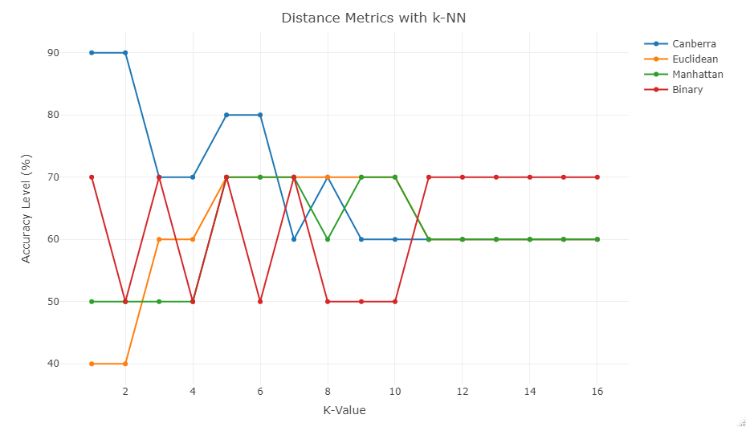

---

---

## Background on Random Forest and k-NN Model Used for Predictions

For training the random forest and k-NN model, the work of Lee *et. al.* has been left out.

### **Random Forest**

The random forest model used for predictions uses *ntree* = 1573 and *mtry* = 2, with an accuracy of 82.8%. The Mo precursor temperature, growth pressure, and growth time stood out as the most important variables in predicting whether a monolayer will form. 

### **k-NN Model**

The k-Nearest Neighbors (k-NN) model uses the canberra distance metric opposed to the traditional euclidean or manhattan metrics. The k value yielding the best results was k=2. 

